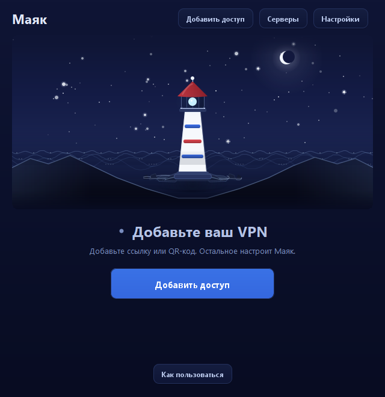
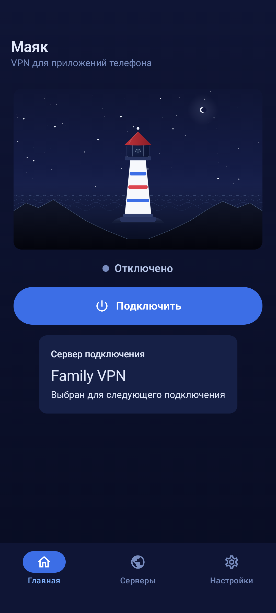

<p align="center">
  
</p>

<h1 align="center">Маяк</h1>

<p align="center">
  <b>Минималистичный VLESS Reality клиент для Windows, macOS, Linux и Android.</b><br>
  Свой сервер, локальные ключи, без аккаунтов, облака и телеметрии.
</p>

<p align="center">
  <a href="https://github.com/vincere-mori/mayak/releases/latest">
    
  </a>
</p>

| ОС | Загрузка |
| --- | --- |
| Windows | [Последний релиз](https://github.com/vincere-mori/mayak/releases/latest) |
| Android | [Последний релиз](https://github.com/vincere-mori/mayak/releases/latest) |
| Linux | [Последний релиз](https://github.com/vincere-mori/mayak/releases/latest) |
| macOS | [Последний релиз](https://github.com/vincere-mori/mayak/releases/latest) |

## Что это

Маяк подключает VPN по ссылке или QR-коду от владельца сервера. Нажмите «Добавить доступ», вставьте ссылку и подключитесь. Параметры сервера заполняются автоматически.

В Windows QR-код можно открыть из изображения, в Android - отсканировать камерой. Ссылка на один сервер и подписка со списком серверов добавляются через одно поле.

## Возможности

- `Proxy` - системный прокси для браузеров и приложений, которые его поддерживают. Права администратора не нужны.
- `TUN` - весь трафик системы через сервер, включая игры и мессенджеры. На desktop нужен запуск с правами администратора или root.
- `WARP` - отдельный маршрут для Google и Gemini через Cloudflare WireGuard.
- Split tunneling - маршруты через VPN или напрямую для доменов, CIDR, Android-приложений и desktop-процессов.
- Настраиваемый DNS, включая DNS-over-HTTPS.
- Android Quick Settings tile и скорость входящего/исходящего трафика.
- Подписки - импорт списка серверов, проверка задержки и выбор нужного профиля.
- Локальное хранение ключей: DPAPI на Windows, Android Keystore на Android, файл профиля в пользовательском конфиге на Linux и macOS.
- Windows: XHTTP Reality через Xray. DNS, маршрутизация и TUN остаются на sing-box. Статус подключения подтверждается запросом через VPN.
- Android: три экрана - главная, серверы и настройки; импорт из меню «Поделиться» и ссылок `vless://` / `mayak://import`.

## Десктоп

<p align="center">
  
</p>

## Android

<p align="center">
  
</p>

## Как начать

1. Скачайте сборку для своей платформы из таблицы выше.
2. Получите ссылку или QR-код у человека или сервиса, который предоставляет VPN.
3. Нажмите «Добавить доступ» и вставьте ссылку или прочитайте QR-код.
4. Нажмите «Подключить». Если доступ содержит несколько серверов, выберите нужный на экране «Серверы».

Windows по умолчанию подключает браузер и приложения с поддержкой системного прокси. Для всех приложений выберите «Весь компьютер» в настройках; Маяк попросит запуск от администратора. Android использует системное VPN-подключение.

Маяк не продает VPN-доступ и не выдает серверы. Нужен свой сервер или ключ от него.

## Примечания

- Windows installer не подписан сертификатом, поэтому SmartScreen может показать предупреждение.
- В Linux `Proxy` режим настраивает системный прокси через `gsettings`, лучше всего работает в GNOME.
- Произвольный JSON не импортируется, поддерживаются `vless://` ключи и подписки с такими ключами.
- Android сейчас поддерживает TCP Reality без PQV. XHTTP и PQV требуют другой интеграции ядра; приложение объясняет ограничение до запроса разрешения VPN.
- Linux и macOS используют TCP Reality из обычных сборок. Для XHTTP на desktop нужен локальный Xray; автоматическая упаковка Xray добавлена для Windows.
- HTTPS-сертификат подписки должен быть действительным. Приложение не отключает его проверку.

## Сборка

Нужны JDK 21+ и Android SDK.

Запуск desktop:

```bat
dev\run-desktop-dev.bat
```

Windows installer:

```bat
dev\build-windows.bat 1.0.1
```

Android APK:

```bat
.\gradlew.bat assembleDebug
```

Linux package:

```bash
dev/package-linux.sh 1.0.1
```

macOS package:

```bash
dev/package-macos.sh 1.0.1
```

## Стек

- Kotlin JVM + Android
- Jetpack Compose
- Swing + FlatLaf
- [sing-box](https://github.com/SagerNet/sing-box)
